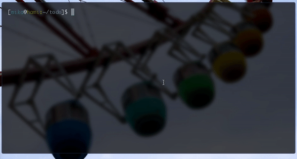

# todo.txt



## Purpose

Adapting a task management system to track personal todos is very beneficial and recommended. However, there are times where you still have to fallback to a simple text file to track your todos. Todo.txt is here to give you at least trackability, when a certain todo in your list has been completed.

It does monitor changes on "todo.txt", copying entries to a seperate, "done.txt" with added time and date. 

To use it, just mark the line item you have completed with an "x" at the end.

You'll need a text editor which can automatically refresh a file like sublime text or vim + vim-autoread plugin.
                                                                                             
## Usage
You can run the fat jar like this:

```java -jar target/todotxt-fat-jar-with-dependencies.jar```

## Prerequesites
- Java Runtime > 1.8
- Apache Maven

## Build
```mvn clean package```
